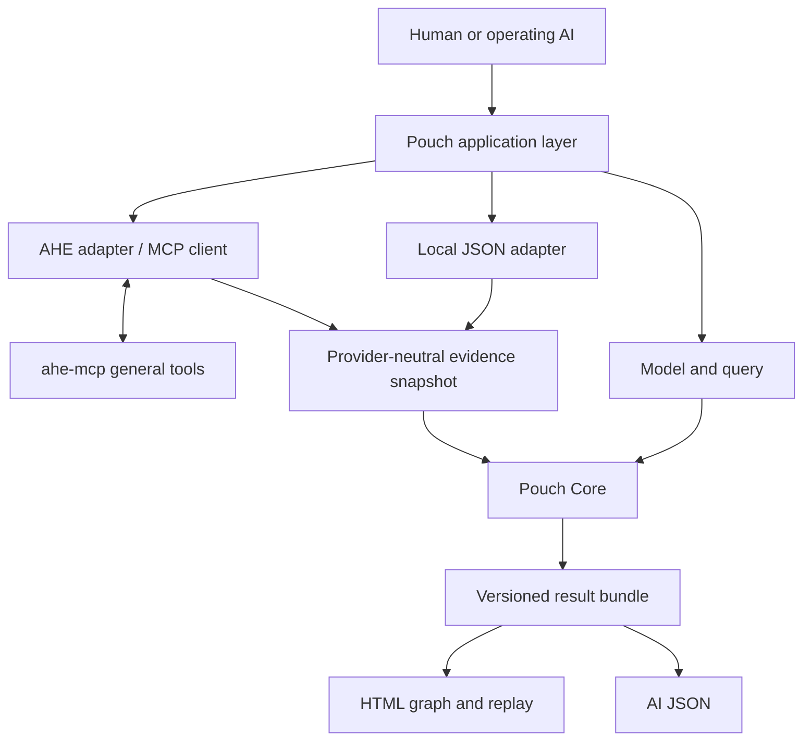

# Pouch Architecture & Specification

Document version: `design.4`; project version: `0.1.0-dev`; 2026-10-04.

This document records the agreed product direction and the current Go implementation. Exact implemented wire types live in the Go packages and format documents. Future objectives are marked explicitly; implementation acceptance is recorded separately.

## 1. Purpose and responsibilities

Given fixed evidence, explicitly declared actions, and a query, search for legal solution paths, display structural and state evolution, and validate each path and its return. The objective is to find a viable route from existing evidence and permitted actions; search must not require an official solution to be supplied in advance.

Any claim about "all paths" must specify the model, query, horizon, path identity, simple/first-hit policy, and completion status. Current goals exclude arbitrary program synthesis, invention of new actions, path merging, and guarantees of physical restoration.

| Role | Responsibility |
| --- | --- |
| Human | Define or approve the problem, assumptions, goals, and applicable evidence changes |
| Operating AI | Interpret diagnostics, decide what to investigate, and prepare proposals for review; Auto mode comes later |
| Pouch application layer | Coordinate commands, version bindings, adapters, execution budgets, results, and presentation |
| Pouch Core | Deterministic representation, solver coordination, and path/return validation; no evidence write authority |
| External provider, such as AHE | Source acquisition or governance, native review, persistence, and readback |

The action model may describe how the world represented by the evidence evolves. Simulation changes that model's state; it does not thereby modify the AHE canonical graph.

## 2. Go boundaries and modules



Current directories:

```text
cmd/pouch/               Local commands and explicit optional AHE commands
cmd/pouch-validate/      Preserved standalone v1 validator CLI
internal/validation/    Original authority, evaluator, replay, DFS/BFS and receipts
internal/projection/    Provider-neutral canonical graph incidence matrices
internal/planning/      Declared action matrices, symbolic CNF and bounded search
internal/candidate/     Finite option compilation, materialization and record binding
internal/sat/           Pinned external SAT/checker processes and raw artifacts
internal/run/           Input bindings, independent certification and bundles
internal/presentation/  Offline HTML generated from the bundle
internal/ahe/           Optional public stdio MCP read/review/admission adapter
internal/cli/           Application wiring and exit/status handling
docs/                   Maintained product docs; detailed run reports ignored
testdata/               Small versioned regression inputs
artifacts/              Ignored local run outputs
third_party/ahe-mcp/    Original notice for ported validation code
```

Core packages (`validation`, `projection`, `planning`) do not import provider, MCP, SQL, HTML or LLM code. `planning.Solver` is a small consumer-owned interface; the application supplies `sat.Runner`. Provider-neutral file inputs and concrete optional AHE profiles are wired at the application boundary. No speculative plugin framework or shared schema module is required.

### Current serialization decision (2026-09-29)

Proceed with the port using the existing versioned JSON formats and typed Go structures. Protobuf is deferred to a later compatibility decision; no protobuf dependency, code generation, shared schema module, or gRPC transport is introduced for this migration.

- Preserve `pouch-finite-validation/v1` field names, types, required fields, and validation semantics. Its existing parser continues to reject missing struct fields, unsupported types, duplicate or aliased keys, and null outside the optional return field. Deferring protobuf does not remove these checks.
- Preserve each source graph's declared JSON format and provenance. A source graph is not an `authority.json` contract. Adapters map supported data explicitly and reject unsupported semantics; they must not silently string-convert values or reinterpret action rules to make an input fit.
- Continue hashing exact frozen bytes for authority, package, and source artifacts. Keep the original bytes available and compare their SHA-256 against the caller-held expected digest. Do not decode and reserialize an artifact before checking its original digest. Formatting changes produce different bytes and therefore a different digest; they must not silently replace an already pinned artifact.
- Keep input preparation and candidate validation separate. The receiver obtains the authority digest and request identity outside the candidate package. A matching hash establishes byte identity, not approval or semantic correctness.

Any future format migration must use an explicit compatibility boundary and acceptance checks. It must not reinterpret existing v1 files or rewrite historical Lab evidence. The migration preserves v1 semantics; the new search, graph and adapter surfaces have separate formats and acceptance results.

## 3. Three inputs

### 3.1 EvidenceSnapshot

- Schema, provider, and snapshot identities, plus a digest of the original content.
- Node and edge IDs, typed relations, payloads, provenance, versions, and temporal/integrity records.
- The complete AND-parent manifest and target of each derivation; this must not degrade into reachability from any one parent.
- Roots, relation scope, direction semantics, depth/node/edge bounds, truncation, and coverage limitations.
- Original responses and mapping records, preserving isolated nodes, parallel edges, self-loops, and unknown relations.

Original text, admitted statements, assumptions, and model conclusions retain their distinct identities. `unknown` is not false, absence from a read is not proof of nonexistence, and `truncated=false` does not establish completeness of the entire world. Graph relations must not automatically become action guards.

### 3.2 PlanningModel

- Finite, precisely typed fields and domains, with a legal-state predicate.
- Action IDs and targets, guards, effects, frames, and costs.
- Every state field covered by exactly one of effect or frame for each action.
- Source-to-rule mappings, declared assumptions, interpretation status, and requirements not covered.
- Model version and digest of the complete bytes; history or side effects that affect future behavior must be part of the state.

The initial executable subset follows the ported validator: string enumerations, AND guards, constant effects, and unit costs. Lab copy effects, general expressions, or other costs must not be silently accepted. Extending the language requires a new contract and comparative acceptance testing.

### 3.3 Query

- Caller-selected request ID, snapshot/model identities, init, Goal, and the complete baseline.
- Separate forward and return search bounds, with an explicit distinction between exact length and at-most length.
- Policies for simple paths, first-hit termination, idle actions, path equivalence, cost, and completeness.
- Timeout, solution-count, and memory budgets; a stop reason must not be reported as UNSAT.

Any change to the model, sources, or Goal creates a new version/query. The validator obtains authoritative inputs outside the candidate package; the package must not define both the question and the answer. Hashes bind bytes. They do not establish authorization, source truth, or complete coverage of the original problem.

### 3.4 Optional finite candidate space

`pouch-candidate-space/v1` declares ordered option groups, source-attributed
forbidden combinations, assumptions, baseline file hashes and literal full-file
templates. `candidate-prepare` compiles this into the existing v1 authority;
ordinary `solve` then uses the same matrix/CNF/SAT and original-rule checks.
The compiler fixes group-selection order to enumerate combinations. It does not
enumerate every file-edit order or derive the options and constraints from text.

`candidate-materialize` revalidates a package against that generated authority
and reads exact baseline bytes before writing a new patch/artifact directory.
`candidate-bind-runtime` separately binds caller-pinned external observations
to the source/model/package/patch and original artifact hashes. The candidate
package depends on model validation, not AHE or a runtime executor. Exact fields,
limits and status meanings are in the [candidate contract](../internal/candidate/README.md).

The generated authority also pins the complete option-space digest. Changing
renderer text or constraints therefore changes the problem identity. That
identity does not prove the declared constraints faithfully express the issue.
Withdrawing choices restores the model's selection baseline; physical file
restoration still requires its own execution and observation record.

## 4. Communication with ahe-mcp

The projects do not import each other's internal Go packages or share database write mechanisms. Pouch owns an optional AHE adapter; AHE does not own a Pouch encoder, validator, or dedicated admission gate.

### 4.1 Reading

The optional adapter uses stdio MCP. It initializes the connection, discovers tools, and invokes general Query tools according to their actual schemas. `open_canonical_read_view` is the currently available entry point for bounded snapshots. Record and provenance tools may supplement the view when needed, with version consistency checked.

Preserve the materialized artifact and scope, not just an in-process handle. Supplemental data outside the same snapshot must retain a separate identity; it must not be assembled into a falsely consistent snapshot. The AI specifies query intent and scope. Software transfers the complete graph, without replacing it with a model-generated summary.

For the supported depth-zero `edges:null` case, the adapter retains original
artifact bytes/hash and separately exports checked projection bytes/hash plus
the named normalization. Feed the projection pair to `solve --graph`; do not
relabel its digest as the original native digest. Missing topology and global
absence remain different claims. See [read/hash semantics](ahe-adapter.md#read-and-hash-semantics).

### 4.2 Submission and review

Writes use an explicitly authorized intake/review profile separate from Query. Pouch may prepare candidate results and their evidence; AHE's general source/endpoint review and admission contracts remain responsible for external governance. If a required tool is unavailable or endpoint semantics do not apply, report `CAPABILITY_UNAVAILABLE` and retain the local result. Do not enable a legacy writer, write directly to the database, or mislabel the result as `observed_fact` to bypass restrictions.

**Do not add a Pouch-specific MCP tool to AHE.** This separation decision supersedes the earlier suggestion to add a dedicated AHE entry point. A receiver/submission coordinator in the Pouch application layer performs the following checks before external persistence:

1. Validate the exact package against the caller-held snapshot, model, and query.
2. Use the actual native review response to check the statement to be saved, the complete parent set, source bytes/versions, and package digest.
3. Present the exact review subject and both kinds of change, obtain explicit approval, and persist through general admission.
4. Retain the Pouch validation receipt and external admission receipt, then verify persistence through a new Query readback.

Successful general AHE admission establishes only that its general governance contract passed; it does not establish that AHE internally enforced Pouch proof validation. If another caller bypasses the Pouch coordinator, this product must not treat the resulting admission receipt as proof of Pouch validation. Without signatures or configured trust, a self-reported validator name or hash is not proof of validator identity either.

A lost response must be recorded as delivery unknown. First query the original request/subject precisely or replay according to the existing contract; do not immediately create a new admission request. Cancellation and network errors must not overwrite a confirmed semantic rejection.

### 4.3 Acceptance status after separation

The adapter is implemented using public MCP profiles. It checks exact schema pins, preserves raw responses, validates locally before preparing a result, and requires an external approval tied to the native display, subject and package hash. See [adapter details](ahe-adapter.md) and [current verification scope](STATUS.md). Historical integration through a dedicated internal API is not counted as acceptance of this new boundary.

The current v1 `source_binding` pins canonical node IDs and exact UTF-8 `statement_text` digests. It does not bind every AHE lifecycle/provenance field or prove a globally atomic currentness cut. Supplemental record reads and a bounded graph snapshot remain separately identified.

## 5. Search, replay, and return

Implemented data flow: snapshot validation → graph projection/source mapping → declared action matrices → symbolic CNF → SAT enumeration → assignment/proof checking → replay under original rules → separate return search or complete non-recoverability certificate → result bundle.

The direct evaluator/BFS/DFS and matrix/CNF encoder are implemented separately and must not read each other's answers. Small models receive complete comparisons between both approaches. Model-package validation uses trusted original rules, not a candidate's transition table.

Individual path validity, set completeness, shortest cost, and recoverability are separate fields. A return path must start from the complete forward endpoint. Full baseline restoration must not be confused with equality of selected fields. When forward and return paths use separate queries, preserve their join-state and version bindings; do not claim acceptance of a combined query.

## 6. Two views of one result bundle

The result bundle must include source/model/query bindings, matrices and indexes, paths, per-step justifications, field deltas, recovery, verification, search coverage, diagnostics, and an artifact manifest. Relative artifact IDs require retrievable content or an explicit missing-artifact marker; a hash list does not mean the files were delivered.

HTML: evidence citations and typed relations, the init matrix, path selection, forward/return playback, guard evaluation, effects/frames, baseline differences, completeness, and original-problem coverage limits. Support/conflict relations that were not obtained must not be drawn as existing edges. State-trace matrices and original encoding matrices must be labeled separately. Source text is escaped and displayed as data, never executed as HTML or script. Exports use portable IDs and expose no local absolute paths.

AI JSON: use the same bundle as HTML, retaining exact IDs, versions, statuses, evidence, and diagnostics. Natural-language summaries are supplemental presentation and must not alter machine judgments. Large sets may use pagination or streaming; mark them complete only when all completion evidence is available.

Materialization and runtime bindings are separate versioned records, not fields
silently added to a completed solve bundle. Materialization keeps its original
`runtime_status=NOT_RUN`; a later `RECORDED_CHECKS_PASS` binding records checks
on supplied observations. Neither regenerating HTML nor binding a record runs
tests. AHE model-package staging does not automatically publish runtime bindings.

## 7. Expressing the absence of a path

The run bundle reports the search/recovery statuses below. The standalone validator retains its original receipt format. Structured input `NEEDS_EVIDENCE` diagnostics are a future refinement; current missing/invalid inputs are explicit command errors.

| Dimension/status | Supported claim |
| --- | --- |
| `input: NEEDS_EVIDENCE` (future) | Required sources, values, or definitions are missing; identify the exact gaps |
| `search: FOUND` | At least one verified path exists; report set completeness separately as complete or partial |
| `search: NO_PATH_WITHIN_BOUND` | No path exists under the specified policy across the fully checked length range |
| `search: NO_PATH_IN_MODEL` | Complete finite reachability validation excludes the Goal |
| `search: INCONCLUSIVE` | Work is incomplete, a tool failed, or a resource limit stopped execution; retain verified partial results |
| `recovery: RETURN_VERIFIED` | The specified result has a verified return path |
| `recovery: NO_RETURN_IN_MODEL` | A complete certificate of baseline unreachability from the specified result passed validation |
| `recovery: UNKNOWN` | No bounded return was found or validation is incomplete; non-recoverability has not been established |

Input coverage and search completeness may differ: for example, search over a finite model may be complete while its snapshot does not cover the entire original problem. `INVALID_INPUT` and `UNSUPPORTED_MODEL` are rejections, not no-path results.

Diagnostics identify failed guards, relevant evidence IDs/revisions, unknown values, query scope, and checkable reasons. Investigation suggestions remain separate from established failure causes. An UNSAT core is neither a minimum-repair proof nor an automatic identification of which fact is missing from the world.

## 8. Two review tracks and Auto mode

| Change | Review and versioning |
| --- | --- |
| AHE evidence addition or revision | AHE evidence governance; preserve old records and obtain a new snapshot after acceptance |
| Pouch Goal, action, assumption, baseline, or search-policy change | Pouch problem review; show the differences and reasons, then create a new model/query |

Evidence approval does not authorize relaxing the goal; goal approval does not establish evidence truth. A goal-only change may reuse the same snapshot. When both change, each requires its own approval before rebinding. New planning runs retain the original run and results without rewriting history.

The future Auto mode objective is: the operating AI reads diagnostics → investigates within its authorization → prepares proposals for the two review tracks → waits for applicable approvals → runs new versions. The AI decides what to investigate, the adapter handles communication, and Core does not autonomously change rules/goals or approve its own conjectures. This phase implements neither an unbounded automatic loop nor automatic admission.

## 9. Exact limits of the existing validator

`internal/validation` retains `pouch-finite-validation/v1`: at most 16 fields, 64 string values per field, 64 actions, 256 forbidden patterns, 4,096 Cartesian states, 8 source bindings, and 4 MiB of JSON. Forward/return limits use at-most semantics. It requires exact casing, rejects unknown or missing struct fields and duplicate or case-aliased keys, and rejects null except for the optional return field.

The validator replays a supplied trace step by step and uses BFS to check unit-cost shortest lengths and the complete reachable closure. `no_return` requires a complete closure. If the baseline remains reachable, even beyond the return horizon, `no_return` is rejected. The validation package independently checks bounded path sets through DFS but does not generate SAT paths, read graphs or validate CNF/DRAT. Those are separate packages. No package validates natural-language source-to-rule interpretation.

`native_ahe_receipt` remains a v1 compatibility field and is always false. It is a data-format field with no AHE calling or writing capability. The run bundle retains the v1 receipt unchanged; external admission/readback is a separate AHE publication record. It does not redefine v1 bytes or schema semantics.

## 10. Code provenance

The standalone v1 validator was ported from `github.com/Yui-Qi-Tang/ahe-mcp`
commit `1af8ff59aae3801c9f5631090920adda3fac1933`. Its package, CLI name and
imports were adapted while preserving the wire contract and validation decisions.
The original notice is retained under `third_party/ahe-mcp/`. Detailed migration
inventories and historical acceptance records are local evidence, separate from
the product specification.

## 11. Verification scope and change obligations

[STATUS](STATUS.md) records completed verification, including the known-answer
SWE migration regression and separate fixed-model native integration. Detailed
experiments remain local evidence. Keep these obligations when extending the
product:

1. Validate strict input contracts, source/query identity and original-rule
   replay, with positive and targeted rejection cases.
2. Compare projection round trips and finite-model matrix/CNF behavior against
   direct rules. Keep path validity, set completeness and recovery distinct.
3. Check materialization against exact baseline bytes and runtime bindings
   against the supplied artifact/test/file scope; do not substitute SAT success
   for repair tests or model withdrawal for physical restoration.
4. Exercise optional public-MCP persistence separately with explicit approval
   and fresh readback. Distinguish HTML generation from browser acceptance.

Porting does not establish complete original-problem coverage, path merging or
unknown program synthesis. New semantic capabilities require explicit contracts
and acceptance, rather than reinterpretation of frozen Lab inputs.
